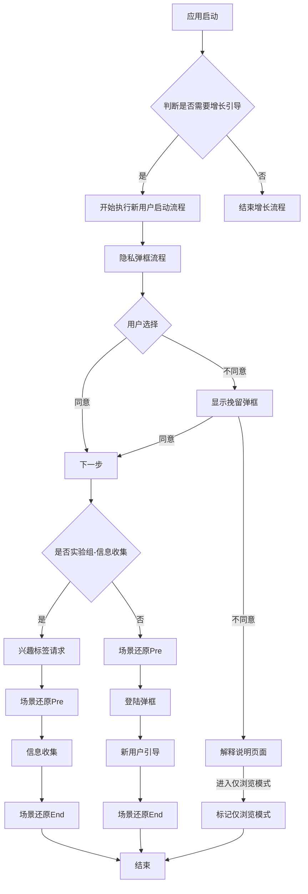
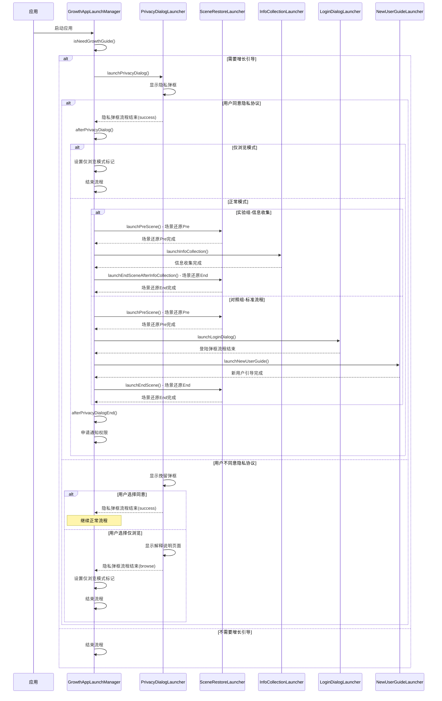
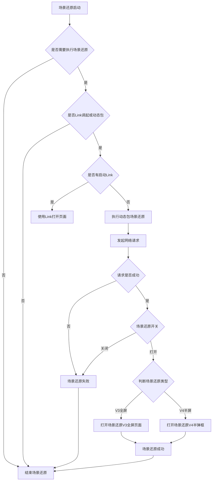
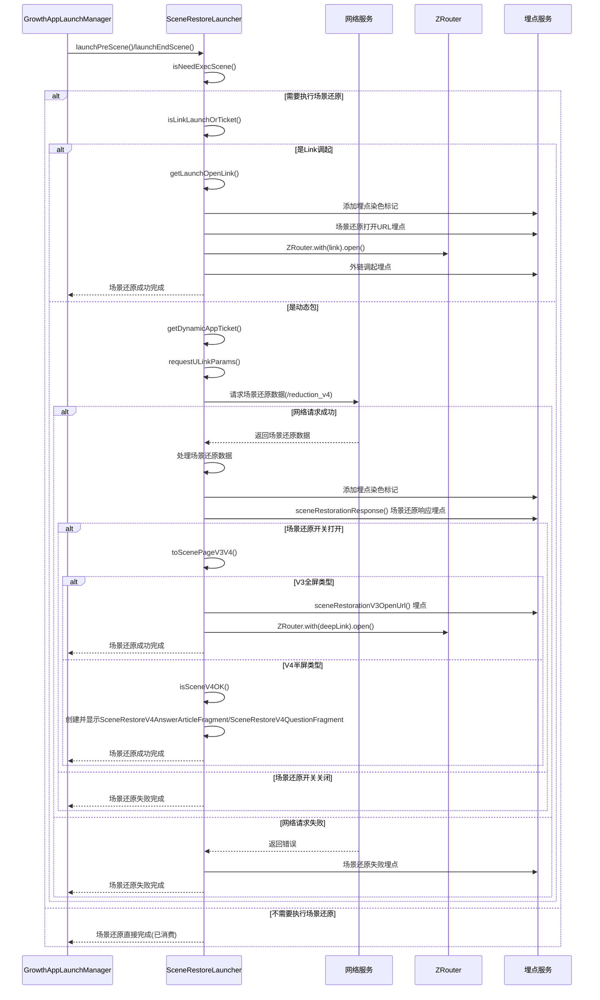
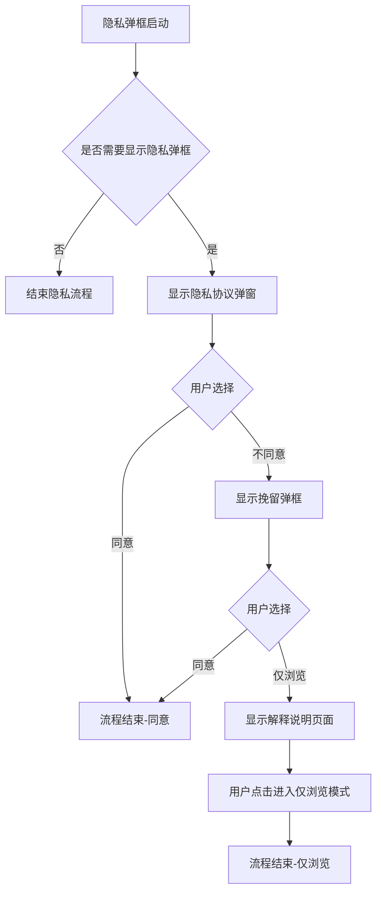
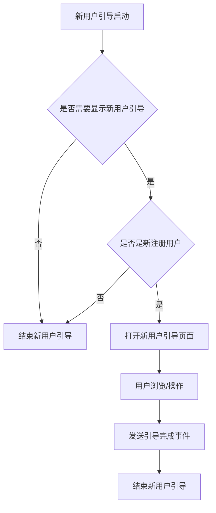
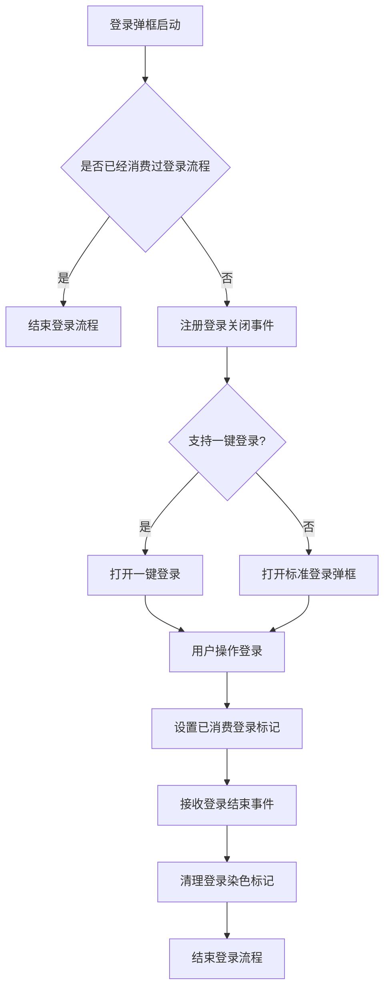
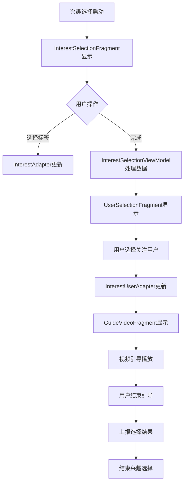

# Growth 流程图与时序图

## 1. Growth 整体架构图

```mermaid
graph TD
    subgraph "用户兴趣引导"
        IS[InterestSelectionFragment] --- ISV[InterestSelectionViewModel]
        IS --- IA[InterestAdapter]
        US[UserSelectionFragment] --- IUA[InterestUserAdapter]
        US --- USV[UserSelectionViewModel]
        GV[GuideVideoFragment] --- CP[ClosePlugin]
    end
    
    subgraph "新用户启动流程"
        GAL[GrowthAppLaunchManager] --> PDL[PrivacyDialogLauncher]
        GAL --> LDL[LoginDialogLauncher]
        GAL --> NUG[NewUserGuideLauncher]
        GAL --> SR[SceneRestoreLauncher]
        GAL --> ICL[InfoCollectionLauncher]
    end
    
    subgraph "设置页-评价功能"
        GMCD[GuideMarketCommentDialog] --- GMCI[GuideMarketCommentImpl]
        GMCI --- GMCIF[GuideMarketCommentInterface]
    end
    
    subgraph "引导用户打开推送开关"
        GPD[GuidePushDialog] --- GPL[GuidePushLifecycle]
        OPGD[OpenPushGuideDialog] --- PDI[PushDialogImpl]
        PDI --- PGDI[PushGuideDialogInterface]
    end
    
    subgraph "新注册用户领取权益"
        FBD[FourEBooksDialog] --- NREDI[NewRegisterEquityDialogImpl]
        NREDI --- NREDIF[NewRegisterEquityDialogInterface]
    end
    
    GAL --> GV
    GAL --> IS
```

## 2. Growth 新用户启动流程图

## 3. Growth 新用户启动时序图

## 4. Growth 场景还原流程图

## 4.1 Growth 场景还原时序图

## 5. Growth 隐私弹框流程图

## 6. Growth 新用户引导流程图

## 7. Growth 登录流程图

## 8. Growth 兴趣选择流程图

