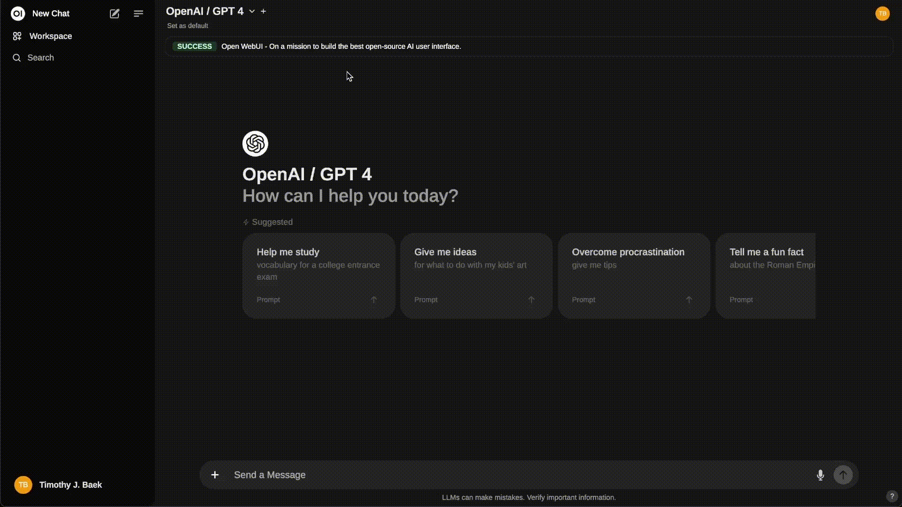

# Open WebUI 本地安装版 🚀



**Open WebUI 是一个功能丰富、用户友好的自托管 AI 平台，专为完全离线运行而设计。** 它支持各种 LLM 运行器，如 **Ollama** 和 **OpenAI 兼容的 API**，内置 **RAG 推理引擎**，是一个强大的 AI 部署解决方案。

本项目提供了 **非 Docker** 的本地安装解决方案，包含自动化安装、启动和管理功能。

## ✨ 特性

- 🚀 **一键安装**: 自动检查环境并安装所有依赖
- 🔧 **智能启动**: 自动启动服务并打开浏览器
- 📊 **进程管理**: 完整的启动、停止和状态监控
- 🛡️ **错误处理**: 智能诊断和自动修复常见问题
- 📝 **日志记录**: 完整的日志系统和故障排除
- 🌐 **跨平台**: 支持 macOS、Linux 和 Windows
- ⚙️ **配置管理**: 灵活的配置选项和环境变量支持

## 📋 系统要求

### 必需条件
- **Python**: 3.11 或 3.12 版本
- **操作系统**: macOS、Linux (x86_64/ARM64) 或 Windows
- **内存**: 至少 4GB RAM (推荐 8GB+)
- **磁盘空间**: 至少 2GB 可用空间
- **网络**: 互联网连接 (用于初始安装)

### 推荐配置
- **Python**: 3.11.x (最佳兼容性)
- **内存**: 8GB+ RAM
- **处理器**: 多核 CPU (推荐 4 核+)
- **浏览器**: Chrome、Firefox、Safari 或 Edge 最新版本

## 🚀 快速开始

### 方法一：自动安装 (推荐)

```bash
# 1. 克隆仓库
git clone https://github.com/ui/open-webui.git
cd open-webui

# 2. 运行安装脚本
./install-openwebui.sh

# 3. 启动服务
./start-openwebui.sh
```

### 方法二：手动安装

```bash
# 1. 克隆仓库
git clone https://github.com/open-webui/open-webui.git
cd open-webui

# 2. 检查 Python 版本
python3.11 --version  # 确保是 3.11 或 3.12

# 3. 安装 Open WebUI
python3.11 -m pip install open-webui

# 4. 启动服务
./start-openwebui.sh
```

### 方法三：使用 pip 直接安装

```bash
# 安装
pip install open-webui

# 启动
open-webui serve
```

## 🎮 使用方法

### 启动服务

```bash
# 使用启动脚本 (推荐)
./start-openwebui.sh

# 或直接命令
open-webui serve
```

启动后会自动：
- ✅ 检查服务状态
- ✅ 启动 Open WebUI 服务
- ✅ 等待服务就绪
- ✅ 自动打开浏览器访问 http://localhost:8080

### 停止服务

```bash
# 使用停止脚本
./stop-openwebui.sh

# 或手动终止
pkill -f "open-webui serve"
```

### 查看日志

```bash
# 实时查看日志
tail -f logs/openwebui.log

# 查看启动日志
cat logs/startup.log

# 查看错误日志
grep ERROR logs/openwebui.log
```

## ⚙️ 配置选项

### 环境变量配置

创建 `.env` 文件来自定义配置：

```bash
# 服务配置
OPENWEBUI_PORT=8080
OPENWEBUI_HOST=0.0.0.0

# 日志配置
LOG_LEVEL=INFO
LOG_FILE=logs/openwebui.log

# 功能配置
AUTO_OPEN_BROWSER=true
WEBUI_SECRET_KEY=your-secret-key

# AI 提供商配置
OPENAI_API_KEY=your-openai-key
OLLAMA_BASE_URL=http://localhost:11434
```

### 命令行参数

```bash
# 指定端口
PORT=8081 open-webui serve

# 指定主机
HOST=127.0.0.1 open-webui serve

# 调试模式
LOG_LEVEL=DEBUG open-webui serve
```

## 🔧 高级配置

### 数据目录

Open WebUI 的数据存储在以下位置：
- **macOS/Linux**: `~/.open-webui/`
- **Windows**: `%APPDATA%\open-webui\`

包含：
- `webui.db` - SQLite 数据库
- `uploads/` - 上传的文件
- `models/` - 本地模型缓存

### 自定义配置文件

创建 `config.yaml` 进行高级配置：

```yaml
server:
  host: "0.0.0.0"
  port: 8080
  workers: 1

logging:
  level: "INFO"
  file: "logs/openwebui.log"
  max_size: "10MB"
  backup_count: 5

features:
  auto_open_browser: true
  enable_signup: true
  enable_web_search: true

ai_providers:
  openai:
    api_key: "${OPENAI_API_KEY}"
    base_url: "https://api.openai.com/v1"
  
  ollama:
    base_url: "http://localhost:11434"
```

## 🛠️ 故障排除

### 常见问题

#### 1. Python 版本不兼容

**问题**: `ERROR: Package 'open-webui' requires a different Python`

**解决方案**:
```bash
# 检查 Python 版本
python3 --version

# 安装 Python 3.11 (macOS)
brew install python@3.11

# 安装 Python 3.11 (Ubuntu)
sudo apt update
sudo apt install python3.11 python3.11-venv

# 使用正确版本安装
python3.11 -m pip install open-webui
```

#### 2. 端口被占用

**问题**: `Address already in use: 8080`

**解决方案**:
```bash
# 查看占用进程
lsof -i :8080

# 终止占用进程
kill -9 $(lsof -t -i:8080)

# 或使用其他端口
PORT=8081 open-webui serve
```

#### 3. 权限问题

**问题**: `Permission denied` 或安装失败

**解决方案**:
```bash
# 使用用户安装
pip install --user open-webui

# 或创建虚拟环境
python3.11 -m venv venv
source venv/bin/activate
pip install open-webui
```

#### 4. 网络连接问题

**问题**: 安装时网络超时

**解决方案**:
```bash
# 使用国内镜像源
pip install -i https://pypi.tuna.tsinghua.edu.cn/simple open-webui

# 或配置代理
pip install --proxy http://proxy.example.com:8080 open-webui
```

#### 5. 服务启动失败

**问题**: 服务无法启动或崩溃

**解决方案**:
```bash
# 检查详细错误
open-webui serve --log-level DEBUG

# 查看系统日志
tail -f logs/openwebui.log

# 重置配置
rm -rf ~/.open-webui/
```

### 诊断工具

运行诊断脚本检查系统状态：

```bash
# 运行系统诊断
./diagnose.sh

# 检查依赖
./check-dependencies.sh

# 测试安装
./test-installation.sh
```

## 📚 使用指南

### 首次设置

1. **访问界面**: 启动后访问 http://localhost:8080
2. **创建账户**: 首次访问时创建管理员账户
3. **配置模型**: 
   - 连接 Ollama: 设置 `http://localhost:11434`
   - 配置 OpenAI: 输入 API 密钥
   - 添加其他提供商

### 基本功能

- **聊天对话**: 与 AI 模型进行对话
- **文档上传**: 上传文档进行 RAG 问答
- **模型管理**: 下载和管理本地模型
- **用户管理**: 创建和管理用户账户
- **插件系统**: 安装和配置插件

### 高级功能

- **API 集成**: 使用 REST API 进行集成
- **自定义模型**: 添加自定义 AI 模型
- **主题定制**: 自定义界面主题
- **数据导出**: 导出聊天记录和数据

## 🔄 更新和维护

### 更新 Open WebUI

```bash
# 更新到最新版本
pip install --upgrade open-webui

# 重启服务
./stop-openwebui.sh
./start-openwebui.sh
```

### 备份数据

```bash
# 备份数据库
cp ~/.open-webui/webui.db ~/backup/

# 备份完整数据目录
tar -czf openwebui-backup-$(date +%Y%m%d).tar.gz ~/.open-webui/
```

### 日志管理

```bash
# 清理旧日志
find logs/ -name "*.log.*" -mtime +7 -delete

# 压缩日志
gzip logs/openwebui.log.1
```

## 🤝 贡献

欢迎贡献代码和反馈！

1. Fork 本仓库
2. 创建功能分支: `git checkout -b feature/amazing-feature`
3. 提交更改: `git commit -m 'Add amazing feature'`
4. 推送分支: `git push origin feature/amazing-feature`
5. 创建 Pull Request

## 📄 许可证

本项目包含多个许可证下的代码。详细信息请参阅 [LICENSE](./LICENSE) 和 [LICENSE_HISTORY](./LICENSE_HISTORY) 文件。

## 🆘 支持

如有问题或建议，请：

1. 查看 [故障排除](#-故障排除) 部分
2. 搜索 [GitHub Issues](https://github.com/open-webui/open-webui/issues)
3. 加入 [Discord 社区](https://discord.gg/5rJgQTnV4s)
4. 查看 [官方文档](https://docs.openwebui.com/)

## 🙏 致谢

感谢 [Open WebUI](https://github.com/open-webui/open-webui) 项目的所有贡献者！

---

**快速链接**:
- 🌐 [在线演示](https://openwebui.com/)
- 📖 [官方文档](https://docs.openwebui.com/)
- 💬 [Discord 社区](https://discord.gg/5rJgQTnV4s)
- 🐛 [报告问题](https://github.com/open-webui/open-webui/issues)
- 💡 [功能请求](https://github.com/open-webui/open-webui/discussions)

**开始使用**: `./start-openwebui.sh` 🚀

## Key Features of Open WebUI ⭐

- 🚀 **Effortless Setup**: Install seamlessly using Docker or Kubernetes (kubectl, kustomize or helm) for a hassle-free experience with support for both `:ollama` and `:cuda` tagged images.

- 🤝 **Ollama/OpenAI API Integration**: Effortlessly integrate OpenAI-compatible APIs for versatile conversations alongside Ollama models. Customize the OpenAI API URL to link with **LMStudio, GroqCloud, Mistral, OpenRouter, and more**.

- 🛡️ **Granular Permissions and User Groups**: By allowing administrators to create detailed user roles and permissions, we ensure a secure user environment. This granularity not only enhances security but also allows for customized user experiences, fostering a sense of ownership and responsibility amongst users.

- 🔄 **SCIM 2.0 Support**: Enterprise-grade user and group provisioning through SCIM 2.0 protocol, enabling seamless integration with identity providers like Okta, Azure AD, and Google Workspace for automated user lifecycle management.

- 📱 **Responsive Design**: Enjoy a seamless experience across Desktop PC, Laptop, and Mobile devices.

- 📱 **Progressive Web App (PWA) for Mobile**: Enjoy a native app-like experience on your mobile device with our PWA, providing offline access on localhost and a seamless user interface.

- ✒️🔢 **Full Markdown and LaTeX Support**: Elevate your LLM experience with comprehensive Markdown and LaTeX capabilities for enriched interaction.

- 🎤📹 **Hands-Free Voice/Video Call**: Experience seamless communication with integrated hands-free voice and video call features, allowing for a more dynamic and interactive chat environment.

- 🛠️ **Model Builder**: Easily create Ollama models via the Web UI. Create and add custom characters/agents, customize chat elements, and import models effortlessly through [Open WebUI Community](https://openwebui.com/) integration.

- 🐍 **Native Python Function Calling Tool**: Enhance your LLMs with built-in code editor support in the tools workspace. Bring Your Own Function (BYOF) by simply adding your pure Python functions, enabling seamless integration with LLMs.

- 📚 **Local RAG Integration**: Dive into the future of chat interactions with groundbreaking Retrieval Augmented Generation (RAG) support. This feature seamlessly integrates document interactions into your chat experience. You can load documents directly into the chat or add files to your document library, effortlessly accessing them using the `#` command before a query.

- 🔍 **Web Search for RAG**: Perform web searches using providers like `SearXNG`, `Google PSE`, `Brave Search`, `serpstack`, `serper`, `Serply`, `DuckDuckGo`, `TavilySearch`, `SearchApi` and `Bing` and inject the results directly into your chat experience.

- 🌐 **Web Browsing Capability**: Seamlessly integrate websites into your chat experience using the `#` command followed by a URL. This feature allows you to incorporate web content directly into your conversations, enhancing the richness and depth of your interactions.

- 🎨 **Image Generation Integration**: Seamlessly incorporate image generation capabilities using options such as AUTOMATIC1111 API or ComfyUI (local), and OpenAI's DALL-E (external), enriching your chat experience with dynamic visual content.

- ⚙️ **Many Models Conversations**: Effortlessly engage with various models simultaneously, harnessing their unique strengths for optimal responses. Enhance your experience by leveraging a diverse set of models in parallel.

- 🔐 **Role-Based Access Control (RBAC)**: Ensure secure access with restricted permissions; only authorized individuals can access your Ollama, and exclusive model creation/pulling rights are reserved for administrators.

- 🌐🌍 **Multilingual Support**: Experience Open WebUI in your preferred language with our internationalization (i18n) support. Join us in expanding our supported languages! We're actively seeking contributors!

- 🧩 **Pipelines, Open WebUI Plugin Support**: Seamlessly integrate custom logic and Python libraries into Open WebUI using [Pipelines Plugin Framework](https://github.com/open-webui/pipelines). Launch your Pipelines instance, set the OpenAI URL to the Pipelines URL, and explore endless possibilities. [Examples](https://github.com/open-webui/pipelines/tree/main/examples) include **Function Calling**, User **Rate Limiting** to control access, **Usage Monitoring** with tools like Langfuse, **Live Translation with LibreTranslate** for multilingual support, **Toxic Message Filtering** and much more.

- 🌟 **Continuous Updates**: We are committed to improving Open WebUI with regular updates, fixes, and new features.

Want to learn more about Open WebUI's features? Check out our [Open WebUI documentation](https://docs.openwebui.com/features) for a comprehensive overview!

## Sponsors 🙌

#### Emerald

<table>
  <!-- <tr>
    <td>
      <a href="https://n8n.io/" target="_blank">
        
      </a>
    </td>
    <td>
      <a href="https://n8n.io/">n8n</a> • Does your interface have a backend yet?<br>Try <a href="https://n8n.io/">n8n</a>
    </td>
  </tr> -->
  <tr>
    <td>
      <a href="https://tailscale.com/blog/self-host-a-local-ai-stack/?utm_source=OpenWebUI&utm_medium=paid-ad-placement&utm_campaign=OpenWebUI-Docs" target="_blank">
        
      </a>
    </td>
    <td>
      <a href="https://tailscale.com/blog/self-host-a-local-ai-stack/?utm_source=OpenWebUI&utm_medium=paid-ad-placement&utm_campaign=OpenWebUI-Docs">Tailscale</a> • Connect self-hosted AI to any device with Tailscale
    </td>
  </tr>
   <tr>
    <td>
      <a href="https://warp.dev/open-webui" target="_blank">
        
      </a>
    </td>
    <td>
      <a href="https://warp.dev/open-webui">Warp</a> • The intelligent terminal for developers
    </td>
  </tr>
</table>

---

We are incredibly grateful for the generous support of our sponsors. Their contributions help us to maintain and improve our project, ensuring we can continue to deliver quality work to our community. Thank you!

## How to Install 🚀

### Installation via Python pip 🐍

Open WebUI can be installed using pip, the Python package installer. Before proceeding, ensure you're using **Python 3.11** to avoid compatibility issues.

1. **Install Open WebUI**:
   Open your terminal and run the following command to install Open WebUI:

   ```bash
   pip install open-webui
   ```

2. **Running Open WebUI**:
   After installation, you can start Open WebUI by executing:

   ```bash
   open-webui serve
   ```

This will start the Open WebUI server, which you can access at [http://localhost:8080](http://localhost:8080)

### Quick Start with Docker 🐳

> [!NOTE]  
> Please note that for certain Docker environments, additional configurations might be needed. If you encounter any connection issues, our detailed guide on [Open WebUI Documentation](https://docs.openwebui.com/) is ready to assist you.

> [!WARNING]
> When using Docker to install Open WebUI, make sure to include the `-v open-webui:/app/backend/data` in your Docker command. This step is crucial as it ensures your database is properly mounted and prevents any loss of data.

> [!TIP]  
> If you wish to utilize Open WebUI with Ollama included or CUDA acceleration, we recommend utilizing our official images tagged with either `:cuda` or `:ollama`. To enable CUDA, you must install the [Nvidia CUDA container toolkit](https://docs.nvidia.com/dgx/nvidia-container-runtime-upgrade/) on your Linux/WSL system.

### Installation with Default Configuration

- **If Ollama is on your computer**, use this command:

  ```bash
  docker run -d -p 3000:8080 --add-host=host.docker.internal:host-gateway -v open-webui:/app/backend/data --name open-webui --restart always ghcr.io/open-webui/open-webui:main
  ```

- **If Ollama is on a Different Server**, use this command:

  To connect to Ollama on another server, change the `OLLAMA_BASE_URL` to the server's URL:

  ```bash
  docker run -d -p 3000:8080 -e OLLAMA_BASE_URL=https://example.com -v open-webui:/app/backend/data --name open-webui --restart always ghcr.io/open-webui/open-webui:main
  ```

- **To run Open WebUI with Nvidia GPU support**, use this command:

  ```bash
  docker run -d -p 3000:8080 --gpus all --add-host=host.docker.internal:host-gateway -v open-webui:/app/backend/data --name open-webui --restart always ghcr.io/open-webui/open-webui:cuda
  ```

### Installation for OpenAI API Usage Only

- **If you're only using OpenAI API**, use this command:

  ```bash
  docker run -d -p 3000:8080 -e OPENAI_API_KEY=your_secret_key -v open-webui:/app/backend/data --name open-webui --restart always ghcr.io/open-webui/open-webui:main
  ```

### Installing Open WebUI with Bundled Ollama Support

This installation method uses a single container image that bundles Open WebUI with Ollama, allowing for a streamlined setup via a single command. Choose the appropriate command based on your hardware setup:

- **With GPU Support**:
  Utilize GPU resources by running the following command:

  ```bash
  docker run -d -p 3000:8080 --gpus=all -v ollama:/root/.ollama -v open-webui:/app/backend/data --name open-webui --restart always ghcr.io/open-webui/open-webui:ollama
  ```

- **For CPU Only**:
  If you're not using a GPU, use this command instead:

  ```bash
  docker run -d -p 3000:8080 -v ollama:/root/.ollama -v open-webui:/app/backend/data --name open-webui --restart always ghcr.io/open-webui/open-webui:ollama
  ```

Both commands facilitate a built-in, hassle-free installation of both Open WebUI and Ollama, ensuring that you can get everything up and running swiftly.

After installation, you can access Open WebUI at [http://localhost:3000](http://localhost:3000). Enjoy! 😄

### Other Installation Methods

We offer various installation alternatives, including non-Docker native installation methods, Docker Compose, Kustomize, and Helm. Visit our [Open WebUI Documentation](https://docs.openwebui.com/getting-started/) or join our [Discord community](https://discord.gg/5rJgQTnV4s) for comprehensive guidance.

Look at the [Local Development Guide](https://docs.openwebui.com/getting-started/advanced-topics/development) for instructions on setting up a local development environment.

### Troubleshooting

Encountering connection issues? Our [Open WebUI Documentation](https://docs.openwebui.com/troubleshooting/) has got you covered. For further assistance and to join our vibrant community, visit the [Open WebUI Discord](https://discord.gg/5rJgQTnV4s).

#### Open WebUI: Server Connection Error

If you're experiencing connection issues, it’s often due to the WebUI docker container not being able to reach the Ollama server at 127.0.0.1:11434 (host.docker.internal:11434) inside the container . Use the `--network=host` flag in your docker command to resolve this. Note that the port changes from 3000 to 8080, resulting in the link: `http://localhost:8080`.

**Example Docker Command**:

```bash
docker run -d --network=host -v open-webui:/app/backend/data -e OLLAMA_BASE_URL=http://127.0.0.1:11434 --name open-webui --restart always ghcr.io/open-webui/open-webui:main
```

### Keeping Your Docker Installation Up-to-Date

In case you want to update your local Docker installation to the latest version, you can do it with [Watchtower](https://containrrr.dev/watchtower/):

```bash
docker run --rm --volume /var/run/docker.sock:/var/run/docker.sock containrrr/watchtower --run-once open-webui
```

In the last part of the command, replace `open-webui` with your container name if it is different.

Check our Updating Guide available in our [Open WebUI Documentation](https://docs.openwebui.com/getting-started/updating).

### Using the Dev Branch 🌙

> [!WARNING]
> The `:dev` branch contains the latest unstable features and changes. Use it at your own risk as it may have bugs or incomplete features.

If you want to try out the latest bleeding-edge features and are okay with occasional instability, you can use the `:dev` tag like this:

```bash
docker run -d -p 3000:8080 -v open-webui:/app/backend/data --name open-webui --add-host=host.docker.internal:host-gateway --restart always ghcr.io/open-webui/open-webui:dev
```

### Offline Mode

If you are running Open WebUI in an offline environment, you can set the `HF_HUB_OFFLINE` environment variable to `1` to prevent attempts to download models from the internet.

```bash
export HF_HUB_OFFLINE=1
```

## What's Next? 🌟

Discover upcoming features on our roadmap in the [Open WebUI Documentation](https://docs.openwebui.com/roadmap/).

## License 📜

This project contains code under multiple licenses. The current codebase includes components licensed under the Open WebUI License with an additional requirement to preserve the "Open WebUI" branding, as well as prior contributions under their respective original licenses. For a detailed record of license changes and the applicable terms for each section of the code, please refer to [LICENSE_HISTORY](./LICENSE_HISTORY). For complete and updated licensing details, please see the [LICENSE](./LICENSE) and [LICENSE_HISTORY](./LICENSE_HISTORY) files.

## Support 💬

If you have any questions, suggestions, or need assistance, please open an issue or join our
[Open WebUI Discord community](https://discord.gg/5rJgQTnV4s) to connect with us! 🤝

## Star History

<a href="https://star-history.com/#open-webui/open-webui&Date">
  <picture>
    <source media="(prefers-color-scheme: dark)" srcset="https://api.star-history.com/svg?repos=open-webui/open-webui&type=Date&theme=dark" />
    <source media="(prefers-color-scheme: light)" srcset="https://api.star-history.com/svg?repos=open-webui/open-webui&type=Date" />
    
  </picture>
</a>

---

Created by [Timothy Jaeryang Baek](https://github.com/tjbck) - Let's make Open WebUI even more amazing together! 💪
